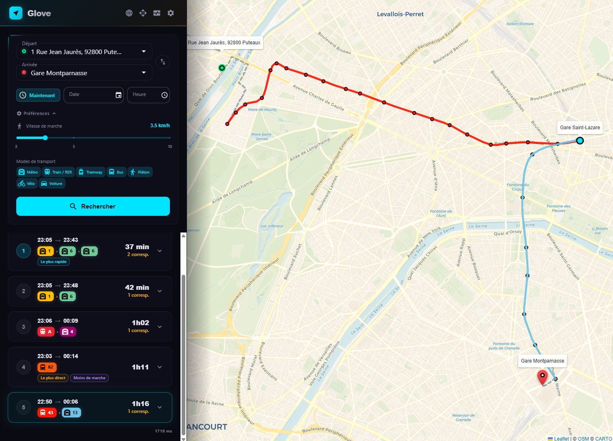
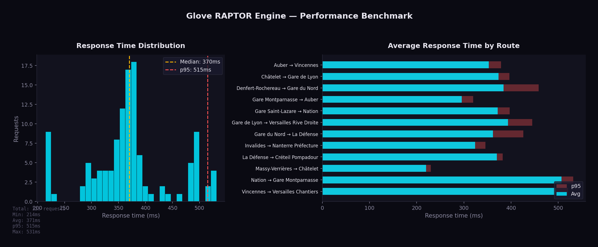

# Glove

[](https://github.com/ltoinel/Glove/actions/workflows/ci.yml)
[](https://codecov.io/gh/ltoinel/Glove)
[](LICENSE.md)
[](https://www.rust-lang.org/)
[](https://react.dev/)
[](https://data.iledefrance-mobilites.fr/)

A fast **multi-modal journey planner** built in Rust with a React frontend.

Glove loads GTFS data into memory, builds a RAPTOR index, and exposes a Navitia-compatible REST API for journey planning. It supports public transit, walking, cycling, and driving via [Valhalla](https://github.com/valhalla/valhalla) integration. The React portal provides an interactive map-based interface with autocomplete, route visualization, and multilingual support (FR/EN).



## Features

### Routing
- **RAPTOR algorithm** — Round-based Public Transit Routing for optimal journey computation
- **Multi-modal** — Public transit, walking, cycling (city / e-bike / road), and driving via Valhalla
- **Diverse alternatives** — Returns up to N different route options by progressively excluding used patterns
- **Journey tags** — Automatically labels journeys: *fastest*, *least transfers*, *least walking*
- **3 bike profiles** — City bike (Velib'), e-bike (VAE), road bike with independent Valhalla routing
- **Elevation-colored routes** — Bike route polylines colored by slope gradient (green=descent, red=climb)
- **Turn-by-turn** — Maneuver-by-maneuver directions for walk, bike, and car routes

### Data & Search
- **Autocomplete** — Fuzzy stop and address search with French diacritics normalization, stops prioritized over addresses
- **BAN integration** — French address geocoding from Base Adresse Nationale data
- **Hot reload** — Reload GTFS data via API without service interruption (lock-free with ArcSwap)

### Frontend
- **Interactive map** — Leaflet map with route polylines, stop markers, origin/destination bubbles
- **Mode tabs** — Switch between Transit, Walk, Bike, and Car
- **Multilingual UI** — French and English, auto-detected from browser
- **Dark theme** — CARTO basemap with glassmorphism UI
- **Map bounds** — Configurable geographic constraints to keep users in the coverage area
- **Metrics panel** — Live process and HTTP metrics dashboard (CPU, memory, uptime, request counts)

### Developer experience
- **Navitia-compatible API** — Drop-in replacement for Navitia query parameters
- **Prometheus metrics** — `GET /api/metrics` endpoint for monitoring
- **OpenAPI documentation** — Auto-generated spec served at `/api-docs/openapi.json`
- **Code coverage** — CI with cargo-tarpaulin and Codecov integration
- **Benchmark tool** — Load testing script with chart generation
- **Dev mode** — `cargo-watch` + Vite HMR for fast iteration
- **Structured config** — Nested YAML configuration (`config.yaml`)
- **Structured logging** — Tracing with configurable log levels

## Quick start

### Prerequisites

- [Rust](https://rustup.rs/) (1.75+)
- [Node.js](https://nodejs.org/) (18+)
- [Docker](https://www.docker.com/) (for Valhalla, optional)

### Download data

```bash
bin/download.sh all      # Download GTFS, OSM and BAN data
bin/download.sh gtfs     # GTFS only
bin/download.sh osm      # OSM only
bin/download.sh ban      # BAN addresses only
```

### Start Valhalla (optional, for walk/bike/car routing)

```bash
bin/valhalla.sh          # Pulls Docker image, builds tiles, starts on port 8002
```

### Run

```bash
bin/start.sh             # Production: builds and starts everything
bin/start.sh --dev       # Dev: cargo-watch + Vite HMR
```

- **API**: http://localhost:8080
- **Portal**: http://localhost:3000 (dev mode)

### Manual start

```bash
# Backend
cargo run --release

# Frontend (in another terminal)
cd portal && npm install && npm run dev
```

## Configuration

All settings are in `config.yaml`, organized in nested sections:

```yaml
server:
  bind: "0.0.0.0"
  port: 8080
  workers: 0                    # 0 = auto (one per CPU)
  log_level: "info"

data:
  dir: "data"                   # sub-dirs gtfs/, osm/, raptor/, ban/ are implicit
  gtfs_url: "https://..."
  osm_url: "https://..."
  ban_url: "https://..."
  departments: [75, 77, 78, 91, 92, 93, 94, 95]

routing:
  max_journeys: 5
  max_transfers: 5
  default_transfer_time: 120    # seconds
  max_duration: 10800           # 3 hours

valhalla:
  host: "localhost"
  port: 8002

map:
  center_lat: 48.8566
  center_lon: 2.3522
  zoom: 11
  bounds_sw_lat: 48.1           # geographic bounds (Ile-de-France)
  bounds_sw_lon: 1.4
  bounds_ne_lat: 49.3
  bounds_ne_lon: 3.6

bike:
  city:                         # City bike (Velib')
    cycling_speed: 16.0
    use_roads: 0.2
    use_hills: 0.3
    bicycle_type: "City"
  ebike:                        # E-bike (VAE)
    cycling_speed: 21.0
    use_roads: 0.4
    use_hills: 0.8
    bicycle_type: "Hybrid"
  road:                         # Road bike
    cycling_speed: 25.0
    use_roads: 0.6
    use_hills: 0.5
    bicycle_type: "Road"
```

## Performance

The RAPTOR engine is designed for speed: all GTFS data is held in memory with optimized data structures (FxHashMap, pattern grouping, binary search on trips).

Benchmark across 12 origin/destination pairs covering Ile-de-France (10 rounds, single-threaded):



| Metric | Value |
|--------|-------|
| Min | 215 ms |
| Avg | 371 ms |
| Median | 370 ms |
| p95 | 515 ms |
| Max | 531 ms |

Run the benchmark yourself:

```bash
python3 bin/benchmark.py --rounds 10 --concurrency 1
```

### Key optimizations

- **Binary search** in `find_earliest_trip` for fast trip lookup within patterns
- **Pre-allocated buffers** reused across RAPTOR rounds (no per-round allocation)
- **FxHashMap** for stop index and calendar exceptions (faster hashing)
- **Lock-free hot-reload** via ArcSwap (atomic pointer swap)
- **Pareto-optimal exploitation** — all journeys from a single RAPTOR run are used before re-running
- **Cache persistence** — RAPTOR index serialized to disk with fingerprint-based invalidation

## API

### `GET /api/journeys/public_transport`

Compute public transit journey alternatives between two stops.

```
GET /api/journeys/public_transport?from=IDFM:22101&to=IDFM:21966&datetime=20260406T083000
```

Key parameters: `from`, `to`, `datetime`, `max_nb_transfers`, `max_duration`, `count`.

### `GET /api/journeys/walk`

Walking directions between two coordinates via Valhalla.

```
GET /api/journeys/walk?from=2.3522;48.8566&to=2.3488;48.8534
```

### `GET /api/journeys/bike`

Cycling directions with three profiles (city, e-bike, road) and elevation data.

```
GET /api/journeys/bike?from=2.3522;48.8566&to=2.3488;48.8534
```

### `GET /api/journeys/car`

Driving directions via Valhalla.

```
GET /api/journeys/car?from=2.3522;48.8566&to=2.3488;48.8534
```

### `GET /api/places`

Stop and address autocomplete with fuzzy search. Stops are prioritized over addresses.

```
GET /api/places?q=chatelet&limit=5
```

### `GET /api/status`

Engine status, GTFS data statistics, and map configuration.

### `GET /api/metrics`

Prometheus metrics (process CPU/memory, HTTP counters, uptime).

### `POST /api/reload`

Hot-reload GTFS data without downtime.

### `GET /api-docs/openapi.json`

OpenAPI 3.0 specification.

## Project structure

```
Glove/
├── src/
│   ├── main.rs              # Entry point, server setup, metrics middleware
│   ├── config.rs            # Nested YAML configuration
│   ├── gtfs.rs              # GTFS data model & CSV loader
│   ├── raptor.rs            # RAPTOR algorithm & index
│   ├── ban.rs               # BAN address geocoding
│   ├── text.rs              # Text normalization (diacritics)
│   └── api/
│       ├── mod.rs           # Shared response types
│       ├── journeys/
│       │   ├── mod.rs       # Journey module
│       │   ├── public_transport.rs
│       │   ├── walk.rs
│       │   ├── bike.rs      # 3 Valhalla profiles (city/ebike/road)
│       │   └── car.rs
│       ├── places.rs        # Autocomplete (stops + addresses)
│       ├── metrics.rs       # Prometheus metrics endpoint
│       └── status.rs        # Status & reload endpoints
├── portal/                  # React frontend (Vite + MUI + Leaflet)
│   ├── src/
│   │   ├── App.jsx          # Main app (search, results, map, metrics panel)
│   │   ├── i18n.jsx         # Internationalization (FR/EN)
│   │   └── main.jsx         # Entry point with MUI theme
│   └── package.json
├── bin/
│   ├── start.sh             # Start script (production & dev)
│   ├── download.sh          # Data download (GTFS, OSM, BAN)
│   ├── valhalla.sh          # Valhalla Docker setup
│   └── benchmark.py         # Performance benchmark with chart generation
├── config.yaml              # Application configuration
└── data/                    # Data files (not committed)
    ├── gtfs/
    ├── osm/
    ├── raptor/
    └── ban/
```

## License

[MIT](LICENSE.md)
