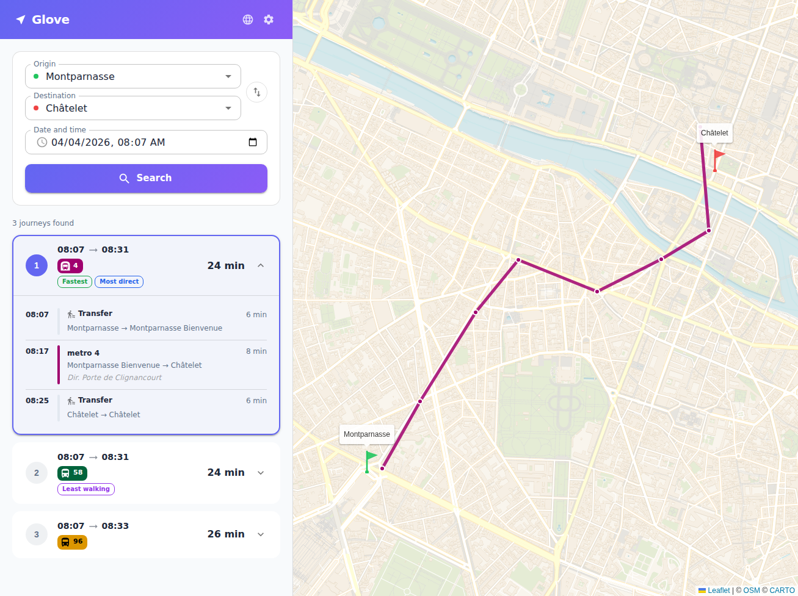

# Glove

[](https://github.com/ltoinel/Glove/actions/workflows/ci.yml)
[](LICENSE.md)
[](https://www.rust-lang.org/)
[](https://react.dev/)
[](https://data.iledefrance-mobilites.fr/)

A fast public transit journey planner for Ile-de-France, built in Rust with a React frontend.

Glove loads GTFS data into memory, builds a RAPTOR index, and exposes a Navitia-compatible REST API for journey planning. The React portal provides an interactive map-based interface with autocomplete, route visualization, and multilingual support (FR/EN).



## Features

- **RAPTOR algorithm** — Round-based Public Transit Routing for optimal journey computation
- **Diverse alternatives** — Returns up to N different route options (fastest to slowest) by progressively excluding used patterns
- **Journey tags** — Automatically labels journeys: *fastest*, *least transfers*, *least walking*
- **Hot reload** — Reload GTFS data via API without service interruption (lock-free with ArcSwap)
- **Autocomplete** — Fuzzy stop name search with diacritics normalization
- **Interactive map** — Leaflet map with route polylines, stop markers, origin/destination flags
- **Navitia-compatible API** — `/api/journeys` supports the same query parameters as Navitia
- **YAML configuration** — All parameters configurable via `config.yaml`
- **Structured logging** — Tracing with configurable log levels
- **Multilingual UI** — French and English, auto-detected from browser

## Quick start

### Prerequisites

- [Rust](https://rustup.rs/) (1.75+)
- [Node.js](https://nodejs.org/) (18+)
- GTFS data files in the `data/` directory

### Run

```bash
./start.sh
```

This builds the Rust backend, installs frontend dependencies, and starts both services:
- **API**: http://localhost:8080
- **Portal**: http://localhost:3000

### Manual start

```bash
# Backend
cargo run --release

# Frontend (in another terminal)
cd portal && npm install && npm run dev
```

## Configuration

All settings are in `config.yaml`:

```yaml
bind: "0.0.0.0"
port: 8080
data_dir: "data"
max_journeys: 5
max_transfers: 5
default_transfer_time: 120   # seconds
max_duration: 10800          # 3 hours
workers: 0                   # 0 = auto (one per CPU)
log_level: "info"
```

## API

### `GET /api/journeys`

Compute journey alternatives between two stops.

```
GET /api/journeys?from=IDFM:22101&to=IDFM:21966&datetime=20260404T083000
```

Key parameters: `from`, `to`, `datetime`, `max_nb_transfers`, `max_duration`, `count`.

### `GET /api/places`

Stop name autocomplete.

```
GET /api/places?q=chatelet&limit=5
```

### `GET /api/status`

Engine status and GTFS data statistics.

### `POST /api/reload`

Hot-reload GTFS data without downtime.

## Project structure

```
Glove/
├── src/
│   ├── main.rs          # Entry point, server setup
│   ├── config.rs        # YAML configuration
│   ├── gtfs.rs          # GTFS data model & CSV loader
│   ├── raptor.rs        # RAPTOR algorithm & index
│   └── api/
│       ├── mod.rs       # Shared response types
│       ├── journeys.rs  # Journey planning endpoint
│       ├── places.rs    # Autocomplete endpoint
│       └── status.rs    # Status & reload endpoints
├── portal/              # React frontend (Vite + MUI + Leaflet)
│   ├── src/
│   │   ├── App.jsx      # Main application component
│   │   ├── i18n.jsx     # Internationalization (FR/EN)
│   │   └── main.jsx     # Entry point with MUI theme
│   └── package.json
├── config.yaml          # Application configuration
├── start.sh             # Startup script
└── data/                # GTFS files (not committed)
```

## License

[MIT](LICENSE.md)
