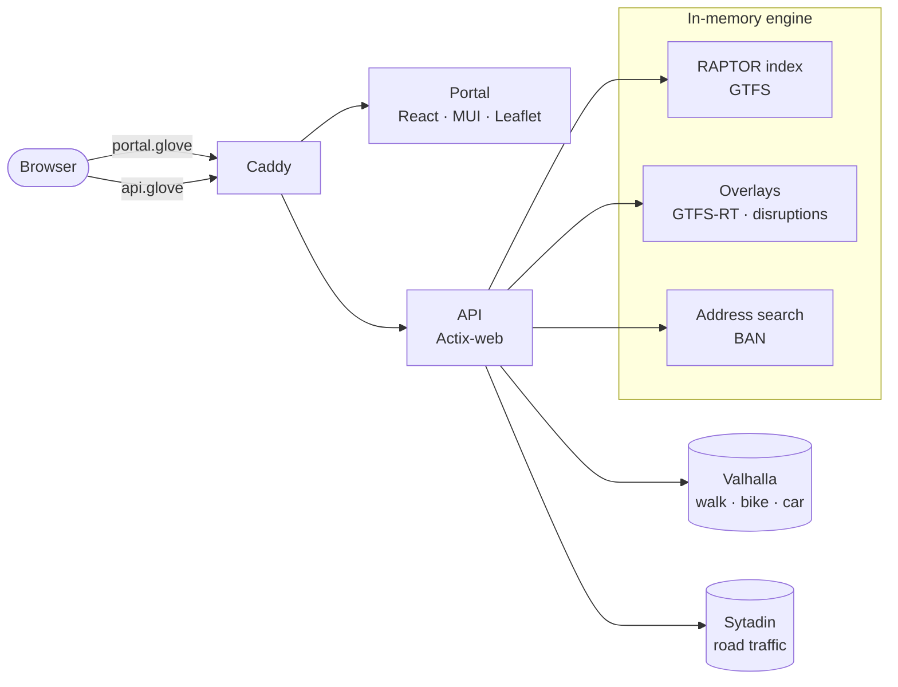

# Glove : GTFS Lightweight Optimal Velocity Engine

[](https://github.com/ltoinel/Glove/actions/workflows/ci.yml)
[](https://codecov.io/gh/ltoinel/Glove)
[](https://ltoinel.github.io/Glove/)
[](LICENSE.md)
[](https://www.rust-lang.org/)
[](https://react.dev/)
[](https://data.iledefrance-mobilites.fr/)

**A fast multi-modal journey planner for the whole Île-de-France network — one Rust binary, no database.**

Glove loads GTFS into memory, builds a [RAPTOR](https://www.microsoft.com/en-us/research/wp-content/uploads/2012/01/raptor_alenex.pdf) index and answers journey searches in **~190 ms** end to end (median, alternatives and walking transfers included, [benchmark](https://ltoinel.github.io/Glove/operations/performance.html)) over every metro, RER, train, tram and bus line of the region. Walking, cycling and driving come from [Valhalla](https://github.com/valhalla/valhalla); real-time delays, operator-declared disruptions and live road traffic are layered on top at query time. A React portal puts it all on a map.


## Quick Start

```bash
bin/download.sh all       # GTFS, OSM, BAN addresses and road traffic data
bin/start.sh --docker     # api + portal + valhalla containers, behind Caddy
```

Then open **https://portal.glove** — the API answers on **https://api.glove**.

<details>
<summary><b>Other ways to run it</b></summary>

```bash
bin/start.sh              # Native release build (built on first run), behind Caddy
bin/start.sh --dev        # cargo-watch + Vite HMR, behind Caddy
```

All modes need a one-time setup — free ports 80/443 for Caddy, add the two names to your hosts file, trust Caddy's local CA. See [Installation](https://ltoinel.github.io/Glove/getting-started/installation.html#one-time-setup).

Without Caddy: `cargo run --release` and `cd portal && npm run dev`, then http://localhost:3000.
</details>

## Try the API

```bash
curl "https://api.glove/api/journeys/public_transport?from=IDFM:monomodalStopPlace:45102&to=IDFM:monomodalStopPlace:470549&datetime=20261006T083000"
```

```jsonc
{
  "journeys": [{
    "departure_date_time": "20261006T083000",
    "arrival_date_time": "20261006T083949",
    "duration": 589,
    "nb_transfers": 0,
    "tags": ["fastest", "least_transfers", "least_walking", "least_waiting"],
    "status": "usable",
    "sections": [{
      "type": "public_transport",
      "from": { "name": "Châtelet - Les Halles" },
      "to":   { "name": "La Défense" },
      "display_informations": { "commercial_mode": "rail", "label": "A" }
      // … stop times, shape, colors
    }]
  }]
}
```

Every endpoint is described by the OpenAPI spec at `/api-docs/openapi.json`, browsable from the portal.

## Features

### Routing
- **RAPTOR** — Round-based transit routing returning diverse, Pareto-optimal alternatives tagged *fastest*, *least transfers*, *least walking*…
- **Multi-modal** — Public transit, walking, cycling (city, e-bike and road profiles, with elevation) and driving
- **Real-time** — GTFS-Realtime delays and cancellations applied at query time, never by rebuilding the index
- **Disruptions** — Works, incidents and closures entered in a back office close stops, lines or sections. A journey they block is still shown, with the reason, rather than silently replaced
- **Indoor-aware transfers** — Station walks routed through underground passages, stairs and elevators
- **Station-aware resolution** — A station resolves to all its platforms, so large hubs (Châtelet, La Défense) route correctly
- **After-midnight routing** — Early-morning queries use the previous service day for night buses and late trains

### Data & Search
- **Fuzzy autocomplete** — Stops and addresses (BAN), with French diacritics normalization
- **GTFS validation** — 19 automated data quality checks
- **Hot reload** — Swap in new GTFS data without downtime (lock-free `ArcSwap`)
- **Live road traffic** — Optional Sytadin (DiRIF) overlay: congestion, roadworks and incidents

### Portal
- **Interactive map** — Leaflet with route polylines, elevation-colored bike routes, traffic and blockage overlays, dark theme
- **Back office** — Disruption management, GTFS validation, dataset statistics, API docs, metrics
- **Multilingual** — French and English

### Operations
- **HTTPS out of the box** — Caddy serves the portal and the API on their own domains
- **Docker images** — Separate API and portal images, plus a Compose stack with Valhalla
- **Observability** — Prometheus metrics, health endpoint, real-time feed matching counters
- **Hardening** — Per-IP rate limiting, API-key protected writes, CORS allow-list, dependency audit in CI

## Architecture


```mermaid
flowchart LR
    Browser(["Browser"]) -->|portal.glove| Caddy
    Browser -->|api.glove| Caddy
    Caddy --> Portal["Portal<br/>React · MUI · Leaflet"]
    Caddy --> API["API<br/>Actix-web"]
    subgraph Engine["In-memory engine"]
        RAPTOR["RAPTOR index<br/>GTFS"]
        Overlays["Overlays<br/>GTFS-RT · disruptions"]
        BAN["Address search<br/>BAN"]
    end
    API --> RAPTOR
    API --> Overlays
    API --> BAN
    API --> Valhalla[("Valhalla<br/>walk · bike · car")]
    API --> Sytadin[("Sytadin<br/>road traffic")]
```

The index is built once at startup (and cached on disk); real-time data and disruptions are separate overlays swapped atomically, so the router never waits on a rebuild. Details in [Architecture](https://ltoinel.github.io/Glove/architecture/overview.html).

## Documentation

Full documentation lives at **[ltoinel.github.io/Glove](https://ltoinel.github.io/Glove/)**:

- [Installation](https://ltoinel.github.io/Glove/getting-started/installation.html) · [Configuration](https://ltoinel.github.io/Glove/getting-started/configuration.html) · [Docker](https://ltoinel.github.io/Glove/getting-started/docker.html)
- [Architecture](https://ltoinel.github.io/Glove/architecture/overview.html) · [RAPTOR algorithm](https://ltoinel.github.io/Glove/architecture/raptor.html)
- [API reference](https://ltoinel.github.io/Glove/api/endpoints.html)
- [Performance](https://ltoinel.github.io/Glove/operations/performance.html) · [Monitoring](https://ltoinel.github.io/Glove/operations/monitoring.html)
- [Contributing](https://ltoinel.github.io/Glove/contributing/development.html)

## Contributing

```bash
git config core.hooksPath .githooks   # lint before each commit, like CI
cargo test && (cd portal && npm test)
```

See the [development guide](https://ltoinel.github.io/Glove/contributing/development.html) for the project layout and conventions.

## Data & Acknowledgements

Glove runs on open data: transit schedules from [Île-de-France Mobilités](https://data.iledefrance-mobilites.fr/), map data © [OpenStreetMap](https://www.openstreetmap.org/copyright) contributors, addresses from the [Base Adresse Nationale](https://adresse.data.gouv.fr/), road traffic from [Sytadin](https://www.sytadin.fr/) (© DiRIF, subject to its usage conditions). Each dataset keeps its own license. Routing for walking, cycling and driving is powered by [Valhalla](https://github.com/valhalla/valhalla).

## License

[MIT](LICENSE.md)
