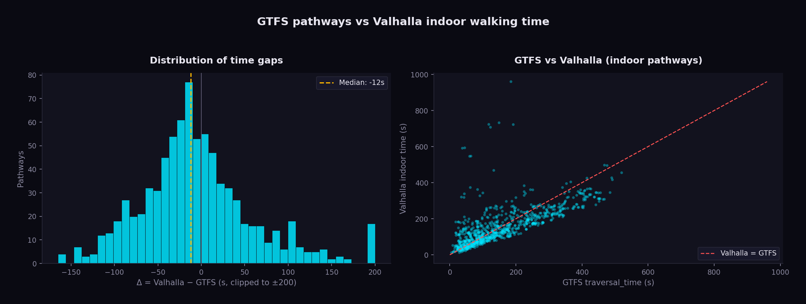

# Pathway Time Gaps

This page ranks the **largest discrepancies** between the GTFS `pathways.txt` `traversal_time` and the indoor walking time computed by Valhalla for the same two station nodes.

```admonish info title="Methodology"
For every pathway with a `traversal_time`, Valhalla is asked for a pedestrian
route between the two nodes using Glove's indoor-friendly costing
(`step_penalty: 0`, `elevator_penalty: 0`, `use_tunnels: 1.0`). A pathway is kept
here only when Valhalla's route **actually uses indoor infrastructure** — i.e. it
contains an elevator / stairs / escalator / building enter-exit maneuver. Δ is
`Valhalla − GTFS`: a positive value means Valhalla is slower than the GTFS
declared time.

Generated by `scripts/pathway_valhalla_diff.py` + `scripts/gen_pathway_gaps_page.py`.
```



## Summary

| Metric | Value |
|--------|-------|
| Pathways with indoor data | 820 |
| Median Δ (Valhalla − GTFS) | -12 s |
| Mean \|Δ\| | 55 s |
| \|Δ\| ≤ 15 s (good agreement) | 193 (24%) |
| \|Δ\| > 30 s | 470 (57%) |
| \|Δ\| > 60 s | 260 (32%) |
| \|Δ\| > 120 s | 58 (7%) |

## Worst stations (≥ 3 indoor pathways)

Stations ranked by mean absolute gap — the highest rows are the stations whose indoor modelling diverges most from GTFS.

| # | Station | Pathways | Median Δ | Mean \|Δ\| | Worst Δ |
|---|---------|---------:|---------:|-----------:|--------:|
| 1 | Aéroport d’Orly (Terminaux 1-2-3) | 14 | +315 s | 331 s | +775 s |
| 2 | Nanterre Université | 3 | +97 s | 213 s | +530 s |
| 3 | Vernouillet - Verneuil | 4 | -18 s | 178 s | +584 s |
| 4 | Place des Fêtes | 3 | +156 s | 133 s | +156 s |
| 5 | Gare du Nord | 70 | -99 s | 97 s | +278 s |
| 6 | Porte de Clichy | 4 | -93 s | 92 s | -95 s |
| 7 | Gare de l'Est | 12 | +83 s | 85 s | +166 s |
| 8 | Avenue Foch | 3 | -52 s | 81 s | +125 s |
| 9 | Les Mureaux | 4 | +96 s | 78 s | +102 s |
| 10 | La Défense | 20 | +68 s | 76 s | +158 s |
| 11 | Bibliothèque François Mitterrand | 10 | +1 s | 67 s | +140 s |
| 12 | Haussmann Saint-Lazare | 10 | +18 s | 65 s | +135 s |
| 13 | Madeleine | 5 | -17 s | 63 s | +116 s |
| 14 | Magenta | 3 | -35 s | 63 s | +90 s |
| 15 | Poissy | 3 | -21 s | 62 s | +125 s |
| 16 | Opéra | 16 | +51 s | 61 s | +132 s |
| 17 | Gare Saint-Lazare | 98 | -36 s | 58 s | +311 s |
| 18 | Gare Montparnasse | 24 | -49 s | 57 s | +294 s |
| 19 | Lagny - Thorigny | 6 | -44 s | 52 s | -97 s |
| 20 | Rueil-Malmaison | 5 | -58 s | 52 s | -104 s |
| 21 | Gare de Lyon | 58 | -41 s | 51 s | -165 s |
| 22 | Gare d'Austerlitz | 4 | -52 s | 50 s | -78 s |
| 23 | Avenue Henri Martin | 3 | -44 s | 49 s | -65 s |
| 24 | Choisy-le-Roi | 4 | -48 s | 46 s | -62 s |
| 25 | Versailles Chantiers | 13 | -44 s | 45 s | -66 s |
| 26 | Montreuil - Hôpital | 6 | +44 s | 41 s | +51 s |
| 27 | Richelieu - Drouot | 15 | -3 s | 39 s | +104 s |
| 28 | Fontainebleau - Avon | 8 | -2 s | 39 s | +101 s |
| 29 | Pantin | 4 | +15 s | 39 s | +89 s |
| 30 | Rosny-sous-Bois | 10 | -42 s | 39 s | -62 s |

## Top 50 individual gaps (descending)

Sorted by absolute gap. `GTFS dist` is the declared pathway length; `Valh dist` is the distance Valhalla actually walked — a much larger `Valh dist` reveals an indoor detour (incomplete OSM connectivity), while a large negative Δ suggests an over-cautious GTFS `traversal_time`.

| # | From → To | GTFS dist | Valh dist | GTFS | Valhalla | Δ |
|---|-----------|----------:|----------:|-----:|---------:|--:|
| 1 | Entrée / Sortie → Orly 1-2-3 | 146 m | 1356 m | 185 s | 960 s | **+775 s** |
| 2 | Parking P3 / VTC - Taxis réservés 3 - Ride app Pick-up → Aéroport d'Orly | 93 m | 1039 m | 118 s | 723 s | **+605 s** |
| 3 | av. du Chemin de Fer → Vernouillet - Verneuil | 97 m | 932 m | 123 s | 707 s | **+584 s** |
| 4 | Bus → Aéroport d'Orly | 117 m | 1050 m | 149 s | 732 s | **+583 s** |
| 5 | Orly 1-2-3 → Aéroport d'Orly | 31 m | 855 m | 38 s | 591 s | **+553 s** |
| 6 | Orly 1-2-3 → Aéroport d'Orly | 36 m | 857 m | 45 s | 593 s | **+548 s** |
| 7 | bd des Provinces Françaises → Nanterre Université | 151 m | 1015 m | 192 s | 722 s | **+530 s** |
| 8 | Orly 4 - T7 - Cœur d'Orly → Aéroport d'Orly | 48 m | 785 m | 60 s | 546 s | **+486 s** |
| 9 | Orly 4 - T7 - Cœur d'Orly → Aéroport d'Orly | 51 m | 786 m | 64 s | 547 s | **+483 s** |
| 10 | Parking (Nord) → Conflans Fin d'Oise | 105 m | 603 m | 133 s | 468 s | **+335 s** |
| 11 | cour de Rome → Saint-Lazare | 49 m | 504 m | 62 s | 373 s | **+311 s** |
| 12 | r. du Cotentin (Gare Vaugirard) → Gare Montparnasse | 35 m | 392 m | 44 s | 338 s | **+294 s** |
| 13 | av. de la Gare → Robinson | 28 m | 428 m | 35 s | 320 s | **+285 s** |
| 14 | r. de Maubeuge → Paris Gare du Nord | 67 m | 489 m | 84 s | 362 s | **+278 s** |
| 15 | pl. Gabriel Péri → Saint-Lazare | 34 m | 454 m | 43 s | 318 s | **+275 s** |
| 16 | Galerie des Marchands → Saint-Lazare | 79 m | 466 m | 100 s | 343 s | **+243 s** |
| 17 | r. de l'Arcade → Saint-Lazare | 72 m | 464 m | 91 s | 327 s | **+236 s** |
| 18 | Terre-plein → Gare de l'Est | 35 m | 291 m | 44 s | 210 s | **+166 s** |
| 19 | bd Diderot → Paris Gare de Lyon | 348 m | 399 m | 442 s | 277 s | **-165 s** |
| 20 | Terre-plein → Gare de l'Est | 14 m | 251 m | 18 s | 182 s | **+164 s** |
| 21 | bd de Denain → Paris Gare du Nord | 368 m | 448 m | 468 s | 308 s | **-160 s** |
| 22 | Parvis - Esplanade → La Défense (Grande Arche) | 177 m | 447 m | 225 s | 383 s | **+158 s** |
| 23 | bd de Denain → Paris Gare du Nord | 365 m | 448 m | 464 s | 307 s | **-157 s** |
| 24 | bd Diderot → Gare de Lyon | 355 m | 415 m | 452 s | 296 s | **-156 s** |
| 25 | Place des Fêtes → pl.des Fêtes | 21 m | 212 m | 26 s | 182 s | **+156 s** |
| 26 | Place des Fêtes → pl.des Fêtes | 21 m | 212 m | 26 s | 182 s | **+156 s** |
| 27 | Parking P3 / VTC - Taxis réservés 3 - Ride app Pick-up → Aéroport d'Orly | 88 m | 370 m | 111 s | 258 s | **+147 s** |
| 28 | Terre-plein → Gare de l'Est | 25 m | 246 m | 32 s | 178 s | **+146 s** |
| 29 | Terre-plein → Gare de l'Est | 38 m | 261 m | 47 s | 192 s | **+145 s** |
| 30 | r. de Dunkerque → Paris Gare du Nord | 358 m | 453 m | 455 s | 311 s | **-144 s** |
| 31 | bd de Denain → Paris Gare du Nord | 318 m | 385 m | 404 s | 260 s | **-144 s** |
| 32 | r. de Dunkerque → Paris Gare du Nord | 355 m | 453 m | 452 s | 310 s | **-142 s** |
| 33 | Terre-plein → Gare de l'Est | 46 m | 269 m | 58 s | 199 s | **+141 s** |
| 34 | r. Goscinny → Bibliothèque François Mitterrand | 87 m | 338 m | 111 s | 251 s | **+140 s** |
| 35 | bd Vaugirard → Gare Montparnasse | 381 m | 424 m | 485 s | 345 s | **-140 s** |
| 36 | r. de Londres → Paris Saint-Lazare | 95 m | 371 m | 121 s | 261 s | **+140 s** |
| 37 | bd Diderot → Paris Gare de Lyon | 355 m | 416 m | 452 s | 312 s | **-140 s** |
| 38 | pl. de la Liberté → Bondy | 32 m | 254 m | 41 s | 180 s | **+139 s** |
| 39 | bd de Denain → Paris Gare du Nord | 315 m | 389 m | 401 s | 262 s | **-139 s** |
| 40 | bd Diderot → Paris Gare de Lyon | 353 m | 415 m | 449 s | 311 s | **-138 s** |
| 41 | r. de Londres → Paris Saint-Lazare | 98 m | 371 m | 125 s | 262 s | **+137 s** |
| 42 | r. Saint-Lazare → Haussmann Saint-Lazare | 88 m | 344 m | 111 s | 246 s | **+135 s** |
| 43 | Entrée / Sortie → Paris Gare du Nord | 318 m | 396 m | 405 s | 270 s | **-135 s** |
| 44 | Opéra → av. de l'Opéra | 110 m | 349 m | 139 s | 271 s | **+132 s** |
| 45 | Entrée / Sortie → Paris Gare du Nord | 315 m | 396 m | 401 s | 269 s | **-132 s** |
| 46 | bd de Denain → Paris Gare du Nord | 269 m | 311 m | 342 s | 210 s | **-132 s** |
| 47 | pl. du Petit Prince → Villepreux - Les Clayes | 44 m | 267 m | 55 s | 184 s | **+129 s** |
| 48 | Haussmann Saint-Lazare → r. Saint-Lazare | 84 m | 326 m | 106 s | 234 s | **+128 s** |
| 49 | Terre-plein → Gare de l'Est | 35 m | 235 m | 44 s | 172 s | **+128 s** |
| 50 | bd de Denain → Paris Gare du Nord | 272 m | 324 m | 345 s | 218 s | **-127 s** |

```admonish note
The full ranking of all 820 indoor pathways (plus pathways with no indoor OSM data) is in `scripts/pathway_diff.csv`.
```
