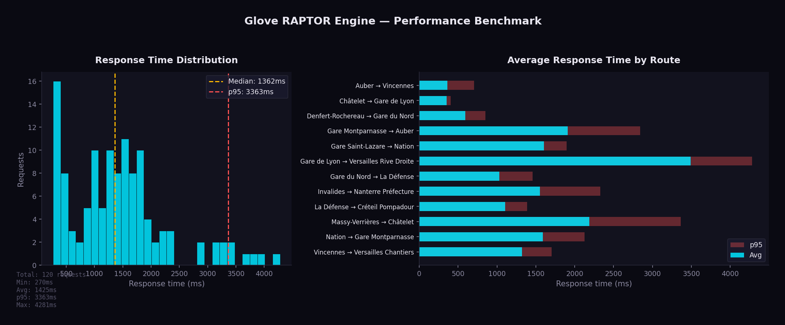

# Routing Statistics

This page presents routing statistics for the IDFM GTFS dataset processed by Glove.

## RAPTOR Index

After loading and pre-processing the GTFS data, Glove builds a RAPTOR index with the following characteristics:

| Metric | Value |
|--------|------:|
| Stops indexed | 54,011 |
| Trips loaded | 495,345 |
| Stop times | 10,933,796 |
| Patterns (grouped trips) | ~15,000 |
| Transfer pairs | 206,822 |
| Index build time | 10-30 seconds |
| Index cache size | ~200 MB |
| RAM usage (loaded) | ~500 MB |

```admonish info title="Pattern Grouping"
Trips with identical stop sequences are grouped into **patterns**. For the IDFM dataset, ~495,000 trips are reduced to ~15,000 patterns — a **33x** reduction that directly speeds up the RAPTOR scan phase.
```

## Query Performance

Benchmark across 12 representative origin/destination pairs covering Ile-de-France (10 rounds, single-threaded):



| Metric | Value |
|--------|------:|
| Min | 215 ms |
| Average | 371 ms |
| Median | 370 ms |
| p95 | 515 ms |
| Max | 531 ms |

Run the benchmark:

```bash
python3 bin/benchmark.py --rounds 10 --concurrency 1
```

## Indoor Routing Coverage

Valhalla pedestrian routing enriches transfer sections with indoor maneuvers when OSM data is available.

| Metric | Value |
|--------|------:|
| Transfer pairs analyzed | 71,479 |
| With indoor data | 3,729 (5.2%) |
| Outdoor only | 67,745 (94.8%) |
| Stations with indoor data | 355 / 9,047 (3.9%) |

### Indoor Maneuvers Found

| Type | Count |
|------|------:|
| Escalator | 3,060 |
| Stairs | 1,441 |
| Elevator | 1,296 |
| Enter building | 34 |
| Exit building | 26 |

### Top 10 Stations by Indoor Score

| Station | Score | Indoor Ratio |
|---------|------:|-------------:|
| Gare Saint-Lazare | 1,344 | 53% |
| La Défense | 1,089 | 57% |
| Gare du Nord | 646 | 52% |
| Massy - Palaiseau | 633 | 87% |
| Gare Montparnasse | 527 | 27% |
| Versailles Chantiers | 478 | 77% |
| Opéra | 384 | 34% |
| République | 332 | 32% |
| Juvisy | 304 | 74% |
| Gare de l'Est | 260 | 32% |

For the full analysis, see [Indoor Routing Coverage](../operations/indoor-coverage.md).

## Valhalla Routing Modes

In addition to public transit (RAPTOR), Glove provides walk/bike/car routing via Valhalla with OSM data for Ile-de-France.

| Mode | Costing | Key Options |
|------|---------|-------------|
| Walk | `pedestrian` | `step_penalty: 30`, `elevator_penalty: 60` |
| City bike | `bicycle` | 16 km/h, avoid hills and roads |
| E-bike | `bicycle` | 21 km/h, hills easy with motor |
| Road bike | `bicycle` | 25 km/h, prefer smooth tarmac |
| Car | `auto` | Default Valhalla settings |

### Bike Profiles

Three bike profiles are configured for the Ile-de-France context:

| Profile | Speed | Use Case | Hills | Roads |
|---------|------:|----------|------:|------:|
| City (Vélib') | 16 km/h | Dense urban areas | Avoid (0.3) | Avoid (0.2) |
| E-bike (VAE) | 21 km/h | Commuting | Easy (0.8) | Accept (0.4) |
| Road | 25 km/h | Fast commuters | Moderate (0.5) | Prefer (0.6) |

## Coverage Area

The default configuration covers the 8 departments of Ile-de-France:

| Department | Code |
|------------|-----:|
| Paris | 75 |
| Seine-et-Marne | 77 |
| Yvelines | 78 |
| Essonne | 91 |
| Hauts-de-Seine | 92 |
| Seine-Saint-Denis | 93 |
| Val-de-Marne | 94 |
| Val-d'Oise | 95 |

Map bounds: SW (48.1, 1.4) to NE (49.3, 3.6), centered on Paris (48.8566, 2.3522).
