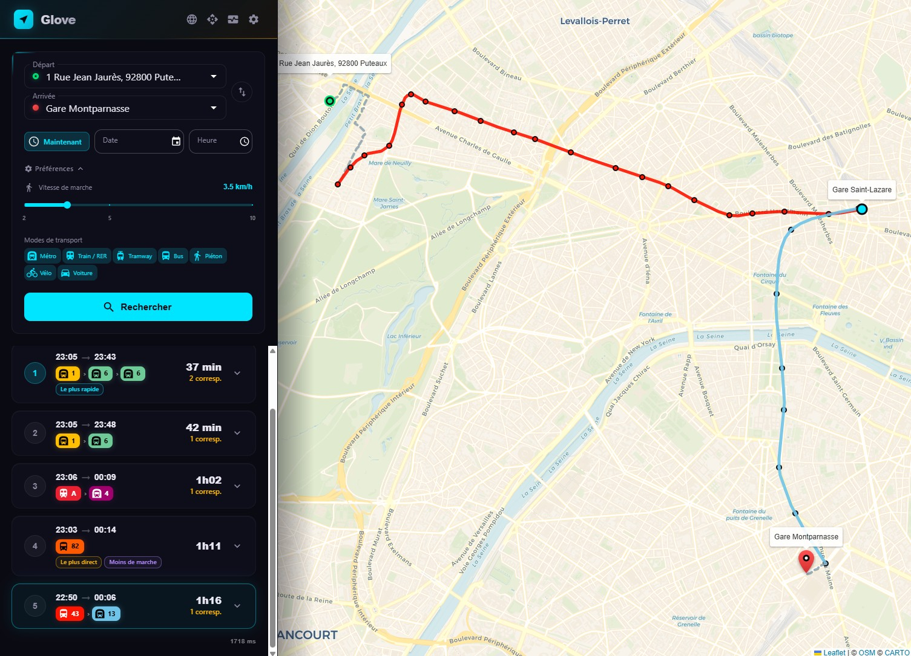

<div class="glove-hero">
<div class="glove-hero-eyebrow">Open-source journey planner</div>
<h1>Glove</h1>
<p class="glove-hero-lead">A fast multi-modal journey planner for Île-de-France: a Rust RAPTOR engine on GTFS data, Valhalla for walking, cycling and driving, and a React map portal.</p>
<div class="glove-hero-actions">
<a class="glove-button primary" href="./getting-started/installation.html">Get started →</a>
<a class="glove-button" href="./api/endpoints.html">API reference</a>
<a class="glove-button" href="https://github.com/ltoinel/Glove">GitHub</a>
</div>
</div>

[](https://github.com/ltoinel/Glove/actions/workflows/ci.yml)
[](https://codecov.io/gh/ltoinel/Glove)
[](https://github.com/ltoinel/Glove/blob/master/LICENSE.md)



Glove loads [GTFS](https://gtfs.org/) data into memory, builds a [RAPTOR](https://www.microsoft.com/en-us/research/wp-content/uploads/2012/01/raptor_alenex.pdf) index, and exposes a **REST API** for journey planning. It supports public transit, walking, cycling, and driving via [Valhalla](https://github.com/valhalla/valhalla) integration.

The React portal provides an interactive map-based interface with autocomplete, route visualization, and multilingual support (FR/EN).

```admonish tip title="Quick Start"
After the [one-time setup](./getting-started/installation.md#one-time-setup) (Caddy ports, `/etc/hosts`, local CA), get up and running in 3 commands:

~~~bash
bin/download.sh all      # Download data
bin/valhalla.sh start    # Start Valhalla (bin/start.sh also starts it if needed)
bin/start.sh             # Build if needed, then start Caddy + the backend
~~~

Then open [https://portal.glove](https://portal.glove). The backend on `localhost:8080` serves the API only.
```

## Explore the documentation

<div class="glove-cards">
<a class="glove-card" href="./getting-started/configuration.html"><span class="glove-card-title">Configuration</span>Every setting of <code>config.yaml</code>: routing, Valhalla, real-time, map.</a>
<a class="glove-card" href="./architecture/raptor.html"><span class="glove-card-title">RAPTOR engine</span>Rounds, vehicle changes, access walks, real-time and disruptions.</a>
<a class="glove-card" href="./api/journeys.html"><span class="glove-card-title">Journey API</span>Public transport, walk, bike and car requests and responses.</a>
<a class="glove-card" href="./idfm/engine-comparison.html"><span class="glove-card-title">Glove vs Hove</span>How Glove's journeys compare with IDFM's planner, and what it fixed.</a>
</div>

## Key Features

### Routing
- **RAPTOR algorithm** for optimal public transit journey computation
- **Multi-modal**: public transit, walking, cycling (3 profiles), driving
- **Diverse alternatives** with progressive pattern exclusion
- **Journey tags**: *fastest*, *least transfers*, *least walking*, *least waiting*
- **Real-time** delays and cancellations (GTFS-Realtime), applied at query time
- **Disruptions** (works, incidents, closures) authored in a back office and applied at query time
- **Elevation-colored bike routes** (green = descent, red = climb)
- **Turn-by-turn directions** for walk, bike, and car routes

### Data & Search
- **Fuzzy autocomplete** with French diacritics normalization
- **BAN integration** for French address geocoding
- **Hot reload** via API without service interruption

### Frontend
- **Interactive Leaflet map** with route polylines and stop markers
- **Mode tabs**: Transit, Walk, Bike, Car
- **Dark theme** with CARTO basemap and glassmorphism UI
- **Map overlays**: live road traffic (Sytadin) and current transit blockages
- **Metrics panel** with live CPU, memory, and request stats

### Developer Experience
- **REST API** documented with OpenAPI
- **OpenAPI documentation** auto-generated
- **Prometheus metrics** endpoint
- **Benchmark tool** for load testing
- **Dev mode** with cargo-watch + Vite HMR
