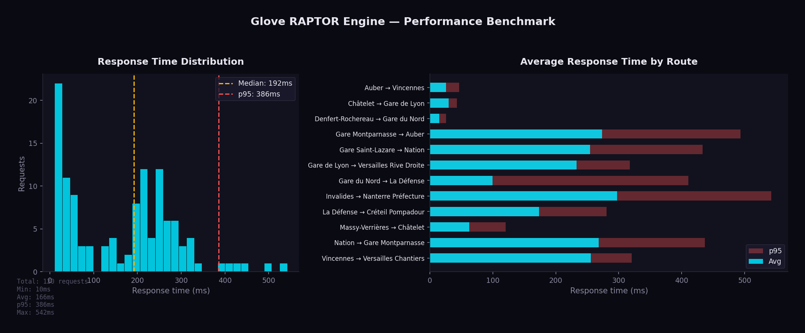

# Performance

## Benchmarks

The RAPTOR engine holds all GTFS data in memory with optimized data structures, so the core round-based scan is fast (single-digit to low-tens of milliseconds). The **end-to-end** response time of `GET /api/journeys/public_transport` is higher because each request also runs the **iterative diverse search** (RAPTOR is re-run up to `max_journeys` times with pattern exclusion to produce varied alternatives) and **enriches transfers via Valhalla** (one walking-route call per transfer).

Benchmark across 12 origin/destination pairs covering Ile-de-France (10 rounds, one request at a time, Tuesday 2026-10-06 08:30 departure), with the default `config.yaml` (`max_journeys: 5`, `prefer_rail: true`). Measured on 2026-10-01 with the release build on a 4-vCPU / 7 GB WSL2 machine that also hosts Valhalla and the benchmark client:



| Metric | Value |
|--------|-------|
| Min | 10 ms |
| Avg | 166 ms |
| Median | 192 ms |
| p95 | 386 ms |
| p99 | 493 ms |
| Max | 542 ms |

| Route | Avg | p95 | Journeys |
|-------|----:|----:|---------:|
| Denfert-Rochereau → Gare du Nord | 15 ms | 26 ms | 1 |
| Auber → Vincennes | 25 ms | 46 ms | 1 |
| Châtelet → Gare de Lyon | 30 ms | 43 ms | 2 |
| Massy-Verrières → Châtelet | 62 ms | 120 ms | 3 |
| Gare du Nord → La Défense | 100 ms | 410 ms | 2 |
| La Défense → Créteil Pompadour | 174 ms | 281 ms | 7 |
| Gare de Lyon → Versailles Rive Droite | 233 ms | 318 ms | 5 |
| Gare Saint-Lazare → Nation | 254 ms | 433 ms | 5 |
| Vincennes → Versailles Chantiers | 255 ms | 320 ms | 6 |
| Nation → Gare Montparnasse | 268 ms | 437 ms | 5 |
| Gare Montparnasse → Auber | 273 ms | 493 ms | 5 |
| Invalides → Nanterre Préfecture | 298 ms | 542 ms | 7 |

```admonish note
These are **end-to-end** API times (iterative diverse search + Valhalla transfer enrichment), not the bare RAPTOR scan. The cost follows the **number of alternatives**: routes that settle on 1–2 journeys answer in tens of milliseconds, while those returning 5–7 distinct journeys re-run RAPTOR several times and enrich each transfer through Valhalla, landing in the 200–300 ms range. Lowering `max_journeys` reduces response time further. The first round is slower (~230 ms avg) while Valhalla, the pooled HTTP connections and the per-thread search buffers warm up.
```

```admonish warning title="Stop-to-stop only"
These pairs use stop ids as origin and destination, and were measured before the access-walk and change-time changes of 2026-10-02. An **address** origin or destination adds one Valhalla pedestrian matrix per endpoint (both in parallel, `routing.walk_matrix_stops` stops each): on 100 random address pairs, Glove answers in **263 ms p50 / 444 ms p95** (release build, local Valhalla) — see [Glove vs Hove](../idfm/engine-comparison.md).
```

```admonish info title="Previous run (2026-05-30)"
The previous published run measured avg 1,425 ms / median 1,362 ms / p95 3,363 ms. The two runs are not strictly comparable: the GTFS dataset is larger (496k trips vs 391k), the host may differ, and the engine changed since then: request-latency work (`861f6bb`) and pooled RAPTOR buffers with FIFO boarding pruning (`b0677b1`).
```

### Concurrent load

Same 12 routes, 10 rounds, **4 client threads** (one per Actix worker) on the same machine:

| Metric | Sequential | 4 threads |
|--------|-----------:|----------:|
| Avg latency | 166 ms | ~400–600 ms |
| p95 latency | 386 ms | ~1.3 s |
| Throughput | ~5–6 req/s | ~7.8 req/s |

On 4 vCPUs shared by the RAPTOR workers, Valhalla and the load generator, concurrency buys throughput (~1.5×) at the cost of per-request latency: the machine is CPU-bound, so these numbers are a floor, not a capacity figure for a dedicated server. Expect run-to-run variance of ±30 % on this kind of host.

## Running Benchmarks

```bash
python3 scripts/benchmark.py --rounds 10 --concurrency 1 --datetime 20261006T083000 \
  --output book/src/images/benchmark.png
```

The benchmark script:
1. Sends requests to 12 representative origin/destination pairs (stop-to-stop)
2. Measures response times across multiple rounds
3. Prints a summary table and generates a chart (`--output`, default `book/src/images/benchmark.png`)

```admonish tip
Pick a `--datetime` that falls inside the loaded GTFS service window (otherwise no journeys are found). For high request rates, set `server.rate_limit: 0` in `config.yaml` so the rate limiter does not reject the burst.
```

## Key Optimizations

### Binary Search in Trip Lookup
The `find_earliest_trip` function uses binary search (O(log n)) to find the first trip departing after a given time within a pattern, instead of linear scan.

### Pooled Search Buffers
The `rounds × stops` tables (arrival times, labels) are pooled per worker thread: dropping a `RaptorResult` hands them back, and the next query on that thread reuses them, resetting only the entries the previous query wrote (or doing a plain fill past `DENSE_RESET_RATIO`). Neither rounds nor queries allocate these tables after the first query on each thread. Labels store `u32` indices to halve the largest table.

### FxHashMap
Uses `rustc-hash`'s FxHashMap throughout both `GtfsData` and `RaptorData`, replacing all standard library `HashMap` instances. FxHash is significantly faster than the default SipHash for integer and string keys.

### Lock-Free Hot-Reload
ArcSwap provides atomic pointer swaps with zero contention. Readers never block, even during a reload. There is no mutex, no RwLock, and no read-side overhead.

### Target + Max-Duration Pruning
`raptor_query_bounded` tracks an upper bound = `min(departure + max_duration, best arrival at the destination)` and refreshes it after each round. Relaxations (and the transfers/markings they trigger) beyond that bound are skipped, so the scan no longer expands the whole 54,000-stop network toward irrelevant or too-distant stops. This roughly halves long suburban queries while returning identical journeys.

### Early Termination in Diversity Loop
The RAPTOR diversity loop (which re-runs the algorithm with pattern exclusion to find alternative journeys) terminates early when a round produces no new journeys, avoiding unnecessary iterations.

### Deduplicated, Parallel Valhalla Calls
Within one request, alternatives often share walks, so each distinct walk is asked of Valhalla once and the calls run concurrently (`join_all`):

- **First/last mile** (address endpoints): one leg per distinct first or last stop, kept in a per-request map of `Arc<WalkLeg>` so journeys sharing a stop share the leg without deep-cloning its polyline. Both ends are fetched in parallel.
- **Transfers**: identical transfers (same stops, same indoor/outdoor kind) across alternatives are sent once and the result is copied to each journey.

Nothing is cached across requests: every query asks Valhalla again.

### Bounded Walk Matrix
For an address endpoint, only the `routing.walk_matrix_stops` (30) nearest candidate stops are sent to the Valhalla `sources_to_targets` matrix. Its cost grows with the stop count — up to 2 s for several hundred stops in central Paris — and capping it brought address queries from 396 ms to 257 ms p50 with no journey made infeasible. Each pedestrian call is bounded by `valhalla.pedestrian_timeout_secs` (5 s).

### Pareto-Optimal Exploitation
All Pareto-optimal journeys from a single RAPTOR run are collected before the algorithm is re-run with pattern exclusion. This avoids redundant computation.

### Cache Persistence
The RAPTOR index is serialized to disk with a fingerprint derived from the GTFS data. On restart, if the fingerprint matches, the cached index is loaded in sub-second time instead of rebuilding (10-30 seconds).

### Pattern Grouping
Trips with identical stop sequences share a single pattern. For the Ile-de-France dataset this collapses ~496,000 trips into ~10,000 patterns, cutting the entities the algorithm scans by an order of magnitude.

## Memory Usage

All GTFS data is held in memory. For the Ile-de-France dataset loaded on 2026-09-28 (as reported by `GET /api/gtfs/status` and `GET /api/metrics`, measured after the benchmark above):

| Data | Approximate Size |
|------|-----------------|
| Stops | ~53,400 entries |
| Routes | ~2,000 entries |
| Trips | ~496,000 entries |
| Stop times | ~11,020,000 entries |
| Transfers | ~192,000 entries |
| Patterns | ~10,000 groups |
| Resident memory (RSS) | ~405 MB |

```admonish note
RSS is up from ~265 MB in the previous measurement, in line with the dataset growth (+27 % trips, +32 % stop times). It covers the whole process: RAPTOR index, BAN address index, traffic overlay and the per-thread pooled search buffers. Virtual memory (~2.4 GB) is reserved address space, not a footprint.
```
